# 🎼 CI/CD Symphony

This project is a demonstration of a fully automated CI/CD pipeline using GitHub Actions. It includes jobs for metrics analysis, security scanning, Slack notifications, baseline updates, and preview environments.

## 🚀 CI/CD Workflow

The pipeline is orchestrated by the `.github/workflows/ci-cd-symphony.yml` file and is split into two main flows:

### 1. Pull Request Flow

This flow runs whenever a pull request is created or updated. It focuses on validation, analysis, and providing a preview environment.

```mermaid
graph TD
    subgraph "Pull Request Flow"
        Start[PR Created/Updated] --> Analysis[📊 Metrics Analysis];
        Start --> Security[🔒 Security Scan];
        
        Analysis --> Notify[💬 Slack Notification];
        Analysis --> Preview[🚀 Deploy Preview];
        
        Preview --> Comment[Add PR Comment with Preview URL];
    end
```



### 2. Main Branch Flow

This flow runs when changes are pushed to the `main` branch (e.g., after a pull request is merged). It focuses on updating the baseline metrics with the latest data from the `main` branch.

```mermaid
graph TD
    subgraph "Push to main Flow"
        Start[Push to main] --> Analysis[📊 Metrics Analysis];
        Start --> Security[🔒 Security Scan];
        
        Analysis --> Notify[💬 Slack Notification];
        Analysis --> Baseline[🎯 Update Baseline];
        
        Baseline --> Commit[Commit & Push Baseline Changes];
    end
```



## 🧑‍💻 Local Development

To get started with local development, follow these steps:

1.  **Install Dependencies**:
    ```bash
    npm install
    ```

2.  **Run the Application**:
    ```bash
    npm start
    ```
    This will build the project and serve it on a local web server (usually `http://localhost:3000`).

3.  **Run Tests**:
    ```bash
    npm test
    ```
    To run tests with coverage, use `npm run coverage`.

## 📊 Current Metrics


## 🚀 Features

### 📈 Automated Analysis
- **Lighthouse Performance**: Measures web vitals, performance metrics, and accessibility
- **Code Coverage**: Tracks test coverage with detailed breakdowns
- **Bundle Size Analysis**: Monitors JavaScript bundle sizes and trends

### 🏷️ Dynamic Badges & Reporting
- **SVG Badges**: Auto-generated status badges for README files
- **Markdown Tables**: Formatted metrics tables with trends
- **JSON API**: RESTful endpoints for programmatic access

### 💬 Smart Notifications
- **PR Comments**: Detailed analysis results posted to pull requests
- **Slack Integration**: Configurable notifications with rich formatting
- **Trend Analysis**: Historical comparisons and recommendations

### 🎯 Baseline Management
- **Automatic Updates**: Baseline metrics updated on main branch merges
- **Quality Gates**: Only acceptable metrics become new baselines
- **Historical Tracking**: Complete metrics history with trend analysis

### 🔒 Security & Quality
- **CodeQL Scanning**: Automated security vulnerability detection
- **NPM Audit**: Dependency security monitoring
- **Quality Thresholds**: Configurable pass/fail criteria

## 🛠️ Quick Start

### 1. Setup Repository

```bash
# Clone and install
git clone <repository-url>
cd CI-CD-Symphony
npm install
```

### 2. Configure Secrets

Add these secrets to your GitHub repository:

```bash
# Required for PR comments (automatically available in GitHub Actions)
GITHUB_TOKEN=<github-token>

# Optional for Slack notifications
SLACK_WEBHOOK_URL=<slack-webhook-url>
```

### 3. Configure Variables (Optional)

Set these repository variables for customization:

```bash
SLACK_CHANNEL=#ci-cd                    # Slack channel for notifications
SLACK_ONLY_FAILURES=false              # Send notifications for all runs or only failures
```

### 4. Trigger Your First Analysis

```bash
# Run locally
npm run ci:analysis
npm run ci:badges
npm run ci:comment  # (if in PR)

# Or push to trigger GitHub Actions
git push origin main
```

## 📋 Available Scripts

### Analysis Scripts
```bash
npm run ci:analysis      # Run complete analysis (Lighthouse + Coverage + Bundle)
npm run ci:badges        # Generate badges and tables
npm run ci:comment       # Post PR comment with results
npm run ci:slack         # Send Slack notification
npm run ci:baseline      # Update baseline metrics
```

### Development Scripts
```bash
npm start               # Start development server
npm run build           # Build for production
npm run test            # Run tests
npm run test:coverage   # Run tests with coverage
npm run lighthouse      # Run Lighthouse analysis
npm run analyze         # Analyze bundle size
```

## 🔌 API Endpoints

Once deployed, your repository will automatically generate API endpoints:

```
Base URL: https://<username>.github.io/<repository>/api/
```

### Available Endpoints

```bash
GET /api/metrics.json          # Current metrics
GET /api/history.json          # Historical data
GET /api/badges/performance.svg # Performance badge
GET /api/badges/coverage.svg   # Coverage badge
GET /api/badges/bundleSize.svg # Bundle size badge
GET /api/badges/status.svg     # Overall status badge
```

### Usage Examples

```javascript
// Fetch current metrics
fetch('https://<username>.github.io/<repository>/api/metrics.json')
  .then(response => response.json())
  .then(data => console.log(data));

// Embed badges in README

```

## 🔧 Configuration

### Lighthouse Configuration

Edit `lighthouserc.json` to customize performance thresholds:

```json
{
  "ci": {
    "assert": {
      "assertions": {
        "categories:performance": ["warn", {"minScore": 0.7}],
        "first-contentful-paint": ["warn", {"maxNumericValue": 2000}]
      }
    }
  }
}
```

### Jest Configuration

Modify `jest.config.js` to adjust coverage thresholds:

```javascript
module.exports = {
  coverageThreshold: {
    global: {
      branches: 80,
      functions: 80,
      lines: 80,
      statements: 80
    }
  }
}
```

### GitHub Actions

The main workflow (`.github/workflows/ci-cd-symphony.yml`) includes:

- **Analysis Job**: Runs on all pushes and PRs
- **Notification Job**: Sends Slack notifications
- **Baseline Job**: Updates baselines on main branch
- **Security Job**: Runs security scans
- **Preview Job**: Deploys PR previews

## 📊 Understanding the Results

### Performance Metrics
- **Score**: Overall Lighthouse performance score (0-100)
- **FCP**: First Contentful Paint (good: <1.8s)
- **LCP**: Largest Contentful Paint (good: <2.5s)
- **CLS**: Cumulative Layout Shift (good: <0.1)
- **TBT**: Total Blocking Time (good: <200ms)

### Coverage Metrics
- **Statements**: Percentage of statements executed
- **Branches**: Percentage of branches taken
- **Functions**: Percentage of functions called
- **Lines**: Percentage of lines executed

### Bundle Analysis
- **Total Size**: Complete bundle size
- **Gzipped**: Estimated compressed size
- **Breakdown**: Size by file type (JS, CSS, assets)

### Status Indicators
- 🟢 **Excellent**: Scores ≥85% overall
- 🟡 **Good**: Scores ≥70% overall
- 🟠 **Warning**: Scores ≥50% overall
- 🔴 **Critical**: Scores <50% overall

## 🎯 Best Practices

### For Performance
- Keep bundle sizes under 250KB
- Optimize images and use modern formats
- Implement code splitting and lazy loading
- Minimize render-blocking resources

### For Coverage
- Aim for ≥80% coverage across all metrics
- Focus on critical business logic
- Write meaningful integration tests
- Test error scenarios and edge cases

### For Baseline Management
- Only merge PRs that meet quality thresholds
- Monitor trends to catch regressions early
- Review baseline updates during deployments
- Document significant metric changes

## 🔍 Troubleshooting

### Common Issues

**Coverage thresholds not met**
```bash
# Lower thresholds temporarily in jest.config.js
# Or add more comprehensive tests
```

**Lighthouse failing**
```bash
# Check if the application builds successfully
npm run build
# Verify the application starts correctly
npm start
```

**Bundle size too large**
```bash
# Analyze bundle composition
npm run analyze
# Check for unused dependencies
npm ls --depth=0
```

**PR comments not appearing**
```bash
# Verify GITHUB_TOKEN has proper permissions
# Check if repository allows GitHub Actions to comment
```

## 🤝 Contributing

1. Fork the repository
2. Create your feature branch (`git checkout -b feature/amazing-feature`)
3. Run tests (`npm test`)
4. Commit your changes (`git commit -m 'Add amazing feature'`)
5. Push to the branch (`git push origin feature/amazing-feature`)
6. Open a Pull Request

## 📜 License

This project is licensed under the MIT License - see the [LICENSE](LICENSE) file for details.

## 🎵 Why "Symphony"?

Because great CI/CD is like a well-orchestrated symphony - every instrument (tool) plays its part in harmony to create something beautiful. Each commit is a note, each PR a movement, and each successful deployment a standing ovation.

---

*Generated with ❤️ by CI/CD Symphony*